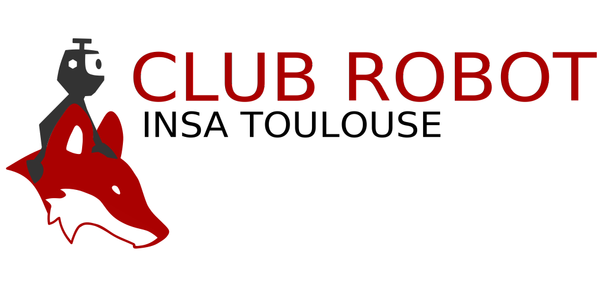

# Robot 2023

Ce répertoire contient tous les fichiers nécessaires à la conception du robot de la coupe de France de robotique 2023.

## Organisation du répertoire

- `docs/` : contient les fichiers de documentation
- `meca/` : contient les fichiers de conception mécanique
- `cartes-elec/` : contient les fichiers de conception électronique
- `elec-soft` : contient les fichiers de programmation des cartes microcontrôleur STM32
- `info` : contient les fichiers pour la raspberry pi

Plus de détails dans les README de chaque dossier.

Lien vers les différents README :
- [README de la partie mécanique](meca/README.md)
- [README de la partie électronique matérielle](cartes-elec/README.md)
- [README de la partie électronique logicielle](elec-soft/README.md)
- [README de la partie informatique](info/README.md)

Lien vers le projet: [Projet Robot 2023](https://github.com/orgs/ClubRobotInsat/projects/4)

## Quelques conseils

Afin de faciliter la collaboration, il est conseillé de suivre les quelques conseils suivants :

- **Créer des branches** : cela permet de travailler sur une fonctionnalité sans impacter le reste du projet.
- **Commitez souvent** : cela permet de garder une trace de l'évolution du projet et de pouvoir revenir en arrière en cas de problème.
- **Commitez des choses fonctionnelles** : cela permet de pouvoir revenir à un état fonctionnel du projet en cas de problème.

## Ressources

- [Site de la coupe de France de robotique](https://www.coupederobotique.fr/)
- [Site de la documentation du club](https://clubrobotinsat.github.io/doc/)

## Auteurs

- [Ronan Bonnet](https://github.com/BloodFutur)